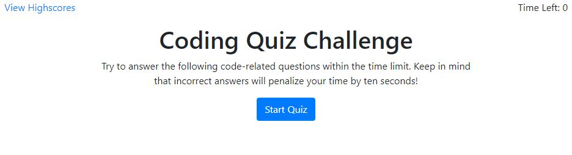
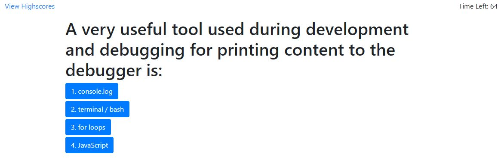
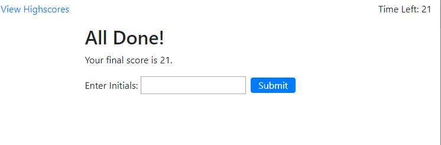
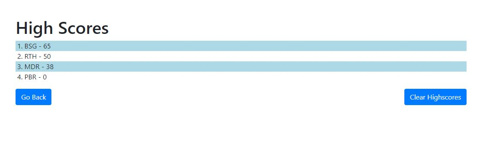

# Coding Quiz

Coding Quiz is an application that presents the user with a timed coding quiz with multiple choice answers.  This app runs in the browser and is responsive to difference screen sizes.

The app presents the user with a series of multiple choice questions that they must answer within an allotted time frame, which is initially 75 seconds.  The time left is displayed to the user, and answering a question incorrectly will decrease the time left by 10 seconds.  On the quiz page there is a link to view the high scores as well.

After the quiz is over, the user is asked to enter his initials so he can submit his score to the high score page.  The high scores and associated names/initials are listed in order of highest score down to the lowest, and will be persisted using local storage.  From the high score page, the user can either go back and take the quiz again, or clear all high scores from the list.

## Scoring Rules

The final score is the remaining time after all questions are answered.  Wrong answers to questions decrease the time left by 10 seconds.  If the user runs out of time, their score will be 0.

## Links

* Deployed App: https://ryan-harris.github.io/code-quiz/
* Github Repo: https://github.com/ryan-harris/code-quiz

## Screenshots

Sample screenshots of application:

